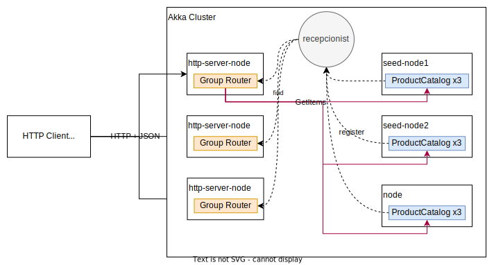

# Lab6 Local and in cluster parallel workload distribution

To efficiently distribute workloads among actors, we use [routers](https://doc.akka.io/docs/akka/current/typed/routers.html) mechanism. 

## Local Pool Routers

An example of the local Pool Router (creating routers within on the same node) can be found in [LocalPoolRoutersDemo](src/main/scala/agh/reactive/routers_demo/pool/LocalPoolRoutersDemo.scala).

## Local Group Routers

An example of the local Group Router (registering workers via recepcionist pattern) can be found in [LocalGroupRoutersDemo](src/main/scala/agh/reactive/routers_demo/group/LocalGroupRoutersDemo.scala).


## HTTP server with local Pool Router

To make our example more attractive, we can build a [simple HTTP server](https://doc.akka.io/docs/akka-http/current/routing-dsl/index.html#minimal-example) to receive work and distribute this work to the local Router Pool.
Take a look at our implementation [WorkHttpApp](src/main/scala/agh/reactive/routers_demo/WorkHttpApp.scala) (it has also simple JSON parser configured).


To run WorkHttpApp
```bash
sbt "runMain agh.reactive.routers_demo.WorkHttpApp 9123"
```

Simple curl to test WorkHttpApp
```bash
curl -X POST \
  http://localhost:9123/work \
  -H 'Content-Type: application/json' \
  -d '{
	"work": "some work to do"
  }'
```

## Multiple HTTP servers with Group Router, workers on separate nodes, bound with the cluster setup

Using [Group Router](https://doc.akka.io/docs/akka/current/typed/routers.html#group-router) we can distribute our work among different nodes using Akka cluster setup.

Our work distributor example - [WorkHttpClusterNodeApp](src/main/scala/agh/reactive/routers_demo/WorkHttpClusterNodeApp.scala).

For cluster configuration see: [application.conf](src/main/resources/application.conf) file.


First setup node cluster:
```bash
# first create workers reigestered under HttpWorker ServiceKey
# run each line in different terminal
sbt "runMain agh.reactive.routers_demo.WorkerClusterNodeApp seed-node1"
sbt "runMain agh.reactive.routers_demo.WorkerClusterNodeApp seed-node2"
sbt "runMain agh.reactive.routers_demo.WorkerClusterNodeApp" # optional - just an  additional node on random port
```

Then run separate server HTTP instances with configured Group Router based on HttpWorker ServiceKey
```bash
# start http servers with Group router connected to HttpWorker ServiceKey recepcionist 
sbt "runMain agh.reactive.routers_demo.WorkHttpClusterNodeApp 9001" 
sbt "runMain agh.reactive.routers_demo.WorkHttpClusterNodeApp 9002" 
sbt "runMain agh.reactive.routers_demo.WorkHttpClusterNodeApp 9003" 
```

Test the app manually:

```bash
curl -X POST \
  http://localhost:9001/work \
  -H 'Content-Type: application/json' \
  -d '{
	"work": "some work to do (cluster-based Group Router)"
  }'
```
Notice which node has processed your work.

## Gatling performance test

(see: https://gatling.io/docs/current/quickstart/)

To start the basic Gatling performance test, run:
```bash
sbt gatling-it:test
```

To open last report:
```bash
sbt gatling-it:lastReport
```

## Hints

Use to be sure that you've killed every instance of sbt
```bash
ps ax | grep sbt | awk '{print $1}' | xargs kill -9
```

## Bonus - Akka Sharding, advanced actor distribution

It is worth taking a look at yet another akka mechanism [Cluster Sharding](https://doc.akka.io/docs/akka/current/typed/cluster-sharding.html). Cluster Sharding is usually used to model distributed domain-related actors (play nicely with DDD approach where each actor is a proper [aggregate](https://martinfowler.com/bliki/DDD_Aggregate.html)).


# Assignments

Use the ProductCatalog related solution from Lab5 to implement the below exercises.
1. (15 points) Scaling and testing load on Product Catalog (local solution)
    * Scale Product Catalog with Pool Router mechanism (multiple Product Catalogs connected to one HTTP server)
    * Conduct performance testing with Gatling, explain which scenario you've implemented and why you used such params. Discuss results.
    * Try to estimate the maximum supported number of users. 
    * Take a look at [Little's Law](https://techcommunity.microsoft.com/t5/testingspot-blog/little-law-of-queuing-theory-and-how-it-impacts-load-testers/ba-p/367620)
    
2. (15 points) Scaling and testing load on Product Catalog (akka cluster-based solution)
    * Configure Akka Cluster with 6 nodes (3 HTTP Servers, 3 Product Catalog worker nodes).
    * Each node should expose REST endpoint on a separate port.
    * Configure HTTP load balancer ([nginx](http://nginx.org/en/docs/http/load_balancing.html or [HAProxy](http://www.haproxy.org/)) or tweak gatling tests to use multiple HTTP servers.
    * Rerun tests from point 1.
    * Try to estimate the maximum supported number of users. 
    * How this architecture affects latency and memory usage?
    
3. (10 points) [Distributed Publish Subscribe in Cluster](https://doc.akka.io/docs/akka/current/typed/distributed-pub-sub.html)
    * Create actor counting number of requests handled by Product Catalog instances. Expose stats via REST endpoint.
    * Create counting actor on a separate dedicated node. 
